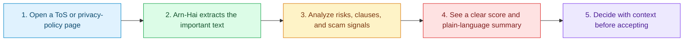

<p align="center">
  
</p>

<p align="center">
  <strong>An AI-powered browser companion that automatically reads Terms of Service and privacy policies, then turns hidden conditions into clear risk signals.</strong>
</p>

<p align="center">
  <a href="#quick-start"></a>
  <a href="#how-it-works"></a>
  <a href="#technology"></a>
</p>

<p align="center">
  
  
  
</p>

> [!NOTE]
> **Champion of "Leagues of Code: AI & Cyber Security Hackathon ครั้งที่ 2"**
>
> - Winner's trophy and **15,000 THB** prize money
> - A full scholarship at **Harbour.Space@UTCC, University of the Thai Chamber of Commerce**, for the entire program, valued at **6,800,000 THB**
> - A **50% scholarship** for the Leagues of Code TH **AI Camp**, valued at **10,500 THB**

## Why Arn-Hai Matters

People accept Terms of Service and privacy policies every day without having the time or legal expertise to see what they are agreeing to. Critical conditions can affect personal data, location tracking, automatic billing, content ownership, and rights to dispute.

**Arn-Hai helps people make consent informed, not automatic.** It reads long policy text, surfaces high-risk clauses, and explains the result in language people can act on before they click Accept.

| Hidden in the fine print | Arn-Hai makes it visible | Why it matters |
| :--- | :--- | :--- |
| Data sharing and retention | Red flags and risk score | Know where personal data may go |
| Location, billing, and arbitration terms | Clause-level summaries | Avoid surprises after accepting |
| Suspicious wording and scam patterns | Safety signals and guidance | Pause before sharing money or credentials |

## How It Works



## What Arn-Hai Delivers

<table>
  <tr>
    <td width="33%" valign="top">
      <h3>Readable policy insights</h3>
      Detect Terms of Service and privacy-policy pages, summarize their meaning, and highlight clauses that deserve attention.
    </td>
    <td width="33%" valign="top">
      <h3>Clear risk signals</h3>
      Use a traffic-light risk score to make difficult legal text easier to compare and prioritize.
    </td>
    <td width="33%" valign="top">
      <h3>Scam-aware browsing</h3>
      Flag common investment, romance, phishing, job, crypto, and impersonation scam signals.
    </td>
  </tr>
</table>

> [!IMPORTANT]
> Arn-Hai provides decision support, not legal advice or a guarantee that a website is safe. Always verify critical decisions with the service provider or a qualified professional.

## Technology

| Layer | Tools |
| :--- | :--- |
| Browser integration | Chrome Extension Manifest V3, Vanilla JavaScript |
| AI analysis | Google Gemini API |
| Local classifier | FastAPI, PyTorch, Hugging Face Transformers |
| Detection | Rule-based ToS risk and scam-signal analysis |
| Interface | HTML, CSS, Chrome Extension APIs |

## Quick Start

```bash
git clone https://github.com/betauzi/ArnHai-TOS.git
```

1. Open `chrome://extensions/`.
2. Enable Developer mode.
3. Select Load unpacked.
4. Choose the cloned `ArnHai-TOS` folder.
5. Open extension settings and enter a Gemini API key, or configure the local classifier.

### Optional Local Classifier

```bash
cd fastapi_server
python -m venv .venv
.venv\\Scripts\\activate
pip install -r requirements.txt
uvicorn main:app --host 127.0.0.1 --port 8000
```

Enable FastAPI in extension settings and use `http://127.0.0.1:8000/classify` as the classifier URL.

## Project Map

```text
background/           Service worker and Gemini/FastAPI integration
content/              Page detection, highlights, and warnings
fastapi_server/       Optional local text-classification service
options/              Extension settings page
popup/                Popup user interface
risk-engine/          ToS risk analysis
scam-detector/        Scam-signal analysis
vendor/               Third-party browser assets
manifest.json         Extension manifest
```

## Privacy and Security

API keys are entered through extension settings and stored in Chrome extension storage. Gemini keys are sent in the `x-goog-api-key` request header, not in URLs. Review the extension's broad host permission before publishing, and never commit API keys, exported Chrome storage, virtual environments, or FastAPI credentials.

## License

No license has been declared for this repository. Add a `LICENSE` file before distributing or accepting external contributions.
